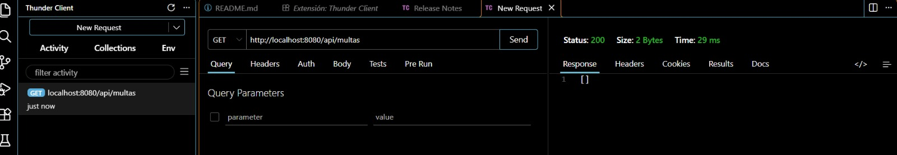
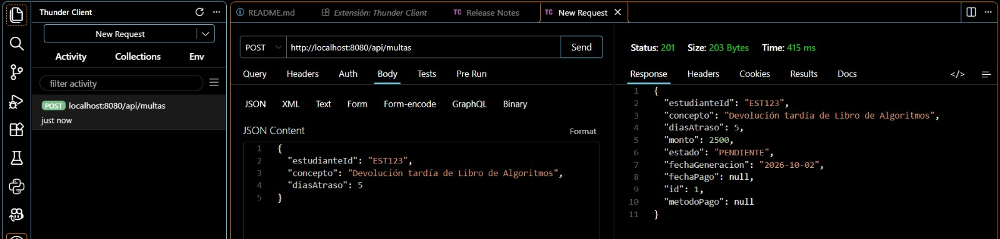
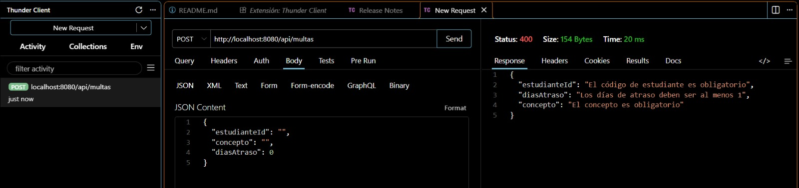
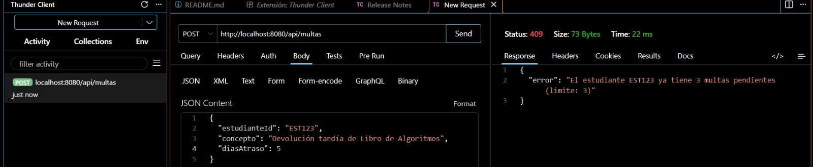
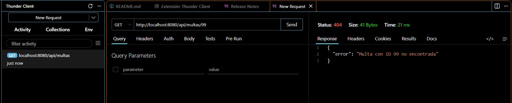
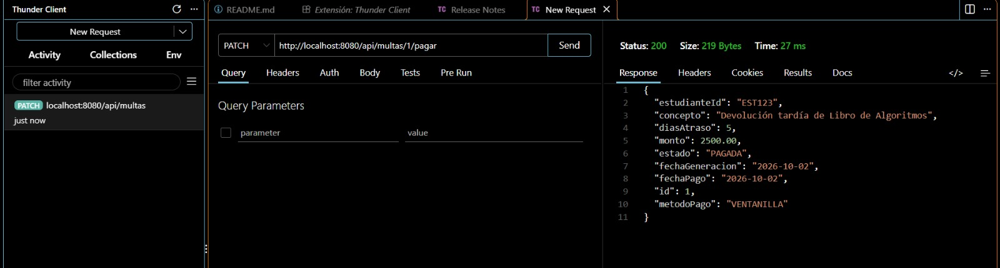
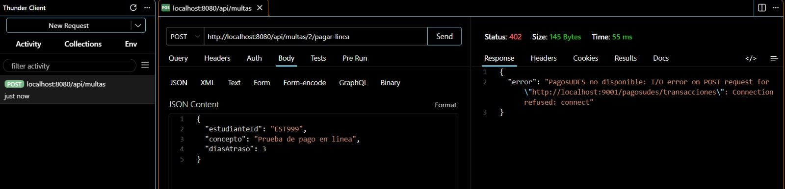
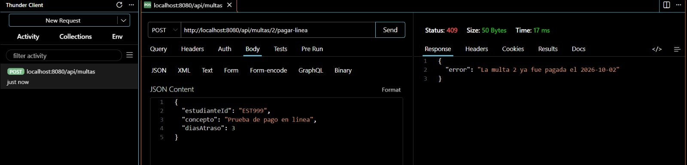

# Post-contenido Unidad 7: Patrones Arquitectónicos I

## Descripción del Proyecto
Backend para la gestión de multas de biblioteca universitaria desarrollado con Spring Boot 3.x, Spring Data JPA y H2 Database. El sistema soporta la generación de multas, límites de mora y pago mediante ventanilla o pasarelas de pago externas dinámicas.

## Parte 1 — Arquitectura en Capas
MultaRepository extiende JpaRepository y agrega una consulta
agregada (countByEstudianteIdAndEstado). MultaService concentra las
reglas de negocio (límite de multas pendientes, generación); el
cálculo del monto vive en la propia entidad Multa
(Multa.calcularMonto). MultaController expone /api/multas. Ver
paquetes model/, repository/, service/ y controller/.

## Parte 2 — Pago en Línea con Dos Pasarelas
Se eligió la Opción C (puerto de dominio con adaptadores — Arquitectura Hexagonal). Se crearon la interfaz `domain/port/PasarelaPagoPort` y el record `domain/ResultadoPago` utilizando Java puro sin dependencias de frameworks. En la capa de infraestructura (`infrastructure/pago/`), se implementaron dos adaptadores concretos (`PagosUdesAdapter` y `WompiAdapter`) que traducen las estructuras HTTP de cada proveedor (transacciones estándar de PagosUDES y montos en centavos de Wompi) a la abstracción unificada `ResultadoPago`. Los adaptadores se seleccionan dinámicamente mediante `@ConditionalOnProperty` utilizando la propiedad `app.pagos.proveedor` en `application.properties`, permitiendo alternar entre pasarelas sin modificar ni recompilar `MultaController` ni `MultaService`.

## Decisiones de diseño

### Punto de decisión 1 — Cálculo del monto: ¿entidad o Service?

El cálculo del monto vive en el método estático `Multa.calcularMonto` dentro de la entidad `Multa` porque es una regla de dominio pura que depende exclusivamente de los días de atraso. Llevar esta lógica a `MultaService` habría generado un modelo de dominio anémico (donde la entidad se reduce a un contenedor pasivo de datos con getters/setters), violando el principio de encapsulamiento y dispersando la cohesión del negocio.

### Punto de decisión 2 — Conteo de multas pendientes: ¿consulta o filtrado en memoria?

Se implementó `countByEstudianteIdAndEstado` directamente en `MultaRepository` para resolver el conteo de multas pendientes a nivel de base de datos (`COUNT` en SQL). Filtrar todas las multas en memoria en el `MultaService` traería historiales completos de estudiantes desde la base de datos a la memoria de la aplicación Java, generando una degradación severa del rendimiento, consumo innecesario de memoria y potenciales problemas de concurrencia a medida que crezca el volumen de datos.

### Punto de decisión 3 — Selección del adaptador activo

Se eligió la anotación `@ConditionalOnProperty` para instanciar un bean único en el contexto de Spring según el valor de `app.pagos.proveedor`. La opción alternativa de cargar un `Map<String, PasarelaPagoPort>` e inyectar el proveedor en tiempo de ejecución se descartó porque el requisito de la vicerrectoría establece que cada sede utiliza una única pasarela fija configurada por despliegue. Cargar múltiples beans inactivos agregaba complejidad de orquestación innecesaria en el servicio.

### Punto de decisión 4 — Diseño del puerto y el tipo de resultado

El record `ResultadoPago` es una estructura de transferencia neutral que unifica las respuestas externas (como `idTransaccion` de PagosUDES o `reference`/`amountInCents` de Wompi). Si el puerto devolviera los DTOs propietarios de un proveedor en particular, `MultaService` quedaría acoplado a los detalles de implementación de dicho proveedor. Esto habría roto el aislamiento del núcleo del negocio y habría obligado a modificar la capa de aplicación cada vez que una pasarela cambiara su contrato HTTP.

### Trade-off considerado — Parte 2

Para la Parte 2 se descartaron las Opciones A (condicionales `if/switch` en el servicio) y B (interfaz Strategy interna en `service/`) en favor de la Opción C (Puerto de Dominio con Adaptadores de Infraestructura). Esta elección garantizó desacoplamiento total, inversión de dependencias estricta y código de aplicación inalterable ante cambios en los proveedores.

No obstante, el costo asumido incluyó la adición de dos nuevos paquetes (`domain` e `infrastructure`), la creación de más interfaces y clases tradutoras de DTOs, y un ligero incremento en la sobrecarga mental al navegar entre capas. Si el piloto finalizara y se adoptara definitivamente una única pasarela institucional sin perspectiva de cambio, el equipo evaluaría revertir hacia una arquitectura en capas extendida (Opción B) para reducir la cantidad de artefactos del proyecto sin perder la abstracción básica.

## Herramientas utilizadas

- **Java 17**, **Spring Boot 4.1**, **Spring Data JPA**, **H2** y **RestTemplate**.
- **Apache Maven** para la gestión y construcción del proyecto.
- **Thunder Client** para las pruebas de los endpoints de la API.
- **Git** y **GitHub** para el control de versiones y almacenamiento del repositorio.

## Conclusiones

La implementación de ambas partes permitió contrastar el impacto directo de elegir el patrón arquitectónico adecuado según los requerimientos de cambio del software. Mientras que la arquitectura en capas facilitó un desarrollo rápido y estructurado para el dominio central de multas, la introducción de integración externa heterogénea exigió la flexibilidad de la arquitectura hexagonal.

El mayor reto al decidir entre extender las capas o introducir un puerto de dominio radicó en evaluar el balance entre la simplicidad del código inicial y la mantenibilidad a largo plazo; aislar el dominio puro de dependencias de Spring aseguró que las evoluciones en la infraestructura externa no afecten las reglas de negocio principales.


## Evidencia de Endpoints Probados

- `GET /api/multas` - Listar multas vacías (`200 OK`)
  

- `POST /api/multas` - Crear multa válida (`201 Created`)
  

- `POST /api/multas` - Error de validación DTO (`400 Bad Request`)
  

- `POST /api/multas` - Límite de multas pendientes superado (`409 Conflict`)
  

- `GET /api/multas/{id}` - Multa no encontrada (`404 Not Found`)
  

- `PATCH /api/multas/{id}/pagar` - Pago en ventanilla (`200 OK`)
  

- `POST /api/multas/{id}/pagar-linea` - Pago en línea rechazado/indisponible (`402 Payment Required`)
  

- `POST /api/multas/{id}/pagar-linea` - Pago en línea de multa ya pagada (`409 Conflict`)
  

---
## Instrucciones de Ejecución

1. Clonar el repositorio:

   ```bash
   git clone https://github.com/cammeza19/meza-post1-u7.git
   cd meza-post1-u7/multas-biblioteca-api

2. Ejecutar la aplicación:

   ```bash
   ./mvnw spring-boot:run
   ```

3. La API estará disponible en:

   ```bash
   http://localhost:8080/api/multas
   ```


4. La consola H2 estará disponible en:

   ```bash
   http://localhost:8080/h2-console
   ```

### Estructura de Paquetes
```text
multas-biblioteca-api/
└── src/main/java/com/example/multas/
    ├── controller/
    │   ├── MultaController.java
    │   ├── MultaRequest.java
    │   └── GlobalExceptionHandler.java
    ├── service/
    │   └── MultaService.java
    ├── model/
    │   ├── Multa.java
    │   ├── EstadoMulta.java
    │   ├── MultaNotFoundException.java
    │   ├── LimiteMultasPendientesException.java
    │   └── MultaYaPagadaException.java
    ├── repository/
    │   └── MultaRepository.java
    ├── domain/
    │   ├── port/
    │   │   └── PasarelaPagoPort.java
    │   ├── ResultadoPago.java
    │   └── PagoRechazadoException.java
    └── infrastructure/
        ├── config/
        │   └── RestTemplateConfig.java
        └── pago/
            ├── PagosUdesAdapter.java
            └── WompiAdapter.java
